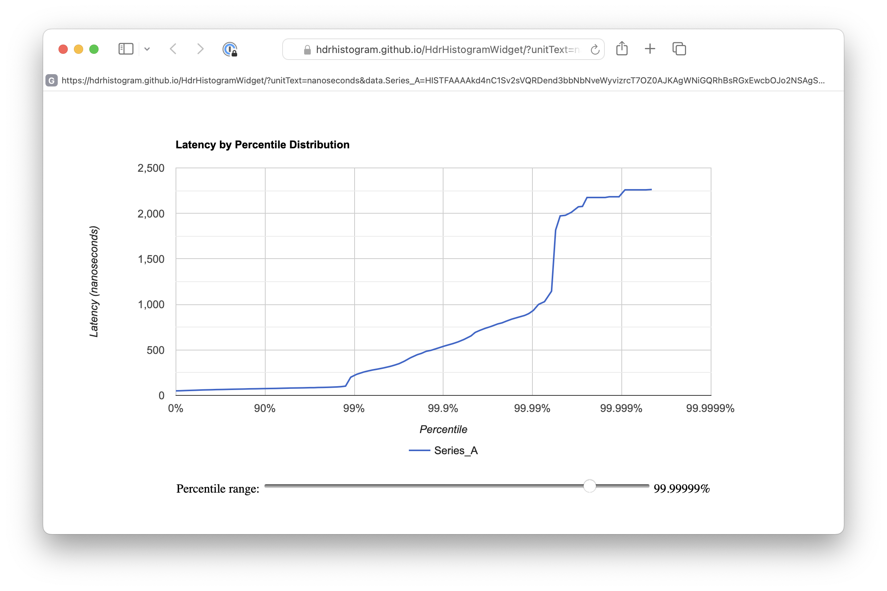

# HdrHistogramCLI 

HDRHistogramCLI is a tool to generate simulated latencies, to summarize them with HDR Histograms, and to test and validate the commutative property of the HDR Histograms.

This builds on top of the excellent [HDRHistogram](https://github.com/HdrHistogram/HdrHistogram) package, as well as the [HdrHistogramWidget](https://github.com/HdrHistogram/HdrHistogramWidget) to graph the resulting data in a browser.

HdrHistogramCLI is based on the idea that real world latency measurements are the result of multiple events occurring with different probabilities, and different latency impacts when they occur.  
Examples of these rare but high-impact events might be packet loss and re-transmission, or delays created by runtime garbage collection cycles, or a cache miss of some type.  Each of these should be rare, but can have a significant impact on latency when they do occur.
These outlier events may have significant impact on the overall experience, and yet may not be easily detectable using conventional metrics like avg(), p90(), p99(), etc.
By modelling these events with independent probability and latency impact, HDRHistogramCLI generates data illustrating HDRHistogram's ability to capture the fine details of latency outliers.

## Sub-commands

The HdrHistogramCLI utility has four sub-commands: data, hist, url, and test.

**Data** will generate a list of values based on the requested count and event probabilities. 

**Hist** will aggregate the data using a HDRHistogram and output the Histogram as a table of values.

**Url** will aggregate the data using a HDRHistogram, and then generate a URL to graph the HDRHistogram using the HdrHistogramWidget at https://hdrhistogram.github.io/HdrHistogramWidget/  For URLs, only int and long histograms are supported.  Double values are not supported.


**test** tests the commutative property of HDR Histograms.  It generates a histogram aggregating all the values, and a separate histogram created by batching the same values, creating intermediate histograms per batch, then merging all of the intermediate histograms together into an aggregated histogram, and then validates that the aggregated histogram is equivalent to the histogram produced by directly recording the values.  

## Parameters
HDRHistogram simulates latencies by modelling the probability and impact of multiple events.  These are based on a probability of occurrence, a mean latency impact if that probability occurs, and a standard deviation of that latency from the mean.  In more concrete terms, the mean and standard deviation are used to generate a Gaussian value around the mean, that represents the latency impact of this event occurring.

The ```--base``` option sets the **base latency** value.  It takes a compound value ```<mean>:<standard deviation>``` As a base latency for the simulation, it has an implied 100% probability.

The ```--event``` option models individual **event latency** events.  This takes a compound value ```<probability>:<mean>:<standard deviation>```.  The event parameter can be specified multiple times to simulate multiple different potential contributors to latency.

The ```--seed``` option sets the random number generator's seed to the supplied value.  This makes the histogram data generation and outputs deterministic.

The ```--type``` option sets the number type used for the histogram.  Valid values are int, long, and double, with the default being long.

The ```<count>``` parameter is a required parameter that specifies the number of simulated values to generate.


## Examples ##
### Histogram table example ###
This is an example of generating a histogram table.
```
java -jar target/hdrhistogram-cli-1.0-SNAPSHOT-jar-with-dependencies.jar hist \
 -b 50:15 \
 -e 0.009:200:50 \
 -e 0.002:400:60 \
 -e 0.0008:600:120 \
 -e 0.00005:2000:100 \
 -e 0.00002:1000:200 \
 -t int 50000000
```
This will generate a table of histogram data, using the integer histogram type, with 50,000,000 recorded values, and:
* a base mean latency of 50, with a stdev of 15
* a 0.9% probability of an event occuring with mean latency of 200, and stddev of 50
* a 0.2% probability of an event occuring with mean latency of 400, and stddev of 60 
* a 0.08% probability of an event occuring with mean latency of 400, and stddev of 60 
* a 0.005% probability of an event occuring with a mean latency of 2000, and a stddev of 100
* a 0.002% probability of an event occurring with a mean latency of 1000, and a stddev of 200

<details>
  <summary>Expand to show the resulting text table</summary>

```
       Value     Percentile TotalCount 1/(1-Percentile)

      50.000 0.000000000000    2626982           1.00
      51.000 0.100000000000    5242177           1.11
      53.000 0.200000000000   10389426           1.25
      55.000 0.300000000000   15356030           1.43
      57.000 0.400000000000   20067396           1.67
      60.000 0.500000000000   26517591           2.00
      61.000 0.550000000000   28476204           2.22
      62.000 0.600000000000   30332276           2.50
      64.000 0.650000000000   33730618           2.86
      65.000 0.700000000000   35271272           3.33
      67.000 0.750000000000   38039541           4.00
      68.000 0.775000000000   39267299           4.44
      69.000 0.800000000000   40395538           5.00
      70.000 0.825000000000   41427184           5.71
      72.000 0.850000000000   43223194           6.67
      73.000 0.875000000000   43993445           8.00
      74.000 0.887500000000   44687326           8.89
      75.000 0.900000000000   45305914          10.00
      76.000 0.912500000000   45857530          11.43
      77.000 0.925000000000   46348954          13.33
      79.000 0.937500000000   47160257          16.00
      80.000 0.943750000000   47492458          17.78
      81.000 0.950000000000   47781849          20.00
      82.000 0.956250000000   48033390          22.86
      83.000 0.962500000000   48251233          26.67
      85.000 0.968750000000   48597430          32.00
      85.000 0.971875000000   48597430          35.56
      87.000 0.975000000000   48848967          40.00
      88.000 0.978125000000   48947034          45.71
      90.000 0.981250000000   49097496          53.33
      93.000 0.984375000000   49241567          64.00
      95.000 0.985937500000   49300173          71.11
     101.000 0.987500000000   49381256          80.00
     197.000 0.989062500000   49454675          91.43
     231.000 0.990625000000   49533245         106.67
     255.000 0.992187500000   49612691         128.00
     266.000 0.992968750000   49651126         142.22
     277.000 0.993750000000   49689068         160.00
     289.000 0.994531250000   49727401         182.86
     303.000 0.995312500000   49766418         213.33
     321.000 0.996093750000   49804971         256.00
     334.000 0.996484375000   49824949         284.44
     352.000 0.996875000000   49843912         320.00
     384.000 0.997265625000   49863624         365.71
     422.000 0.997656250000   49882950         426.67
     453.000 0.998046875000   49902864         512.00
     467.000 0.998242187500   49912425         568.89
     481.000 0.998437500000   49921875         640.00
     497.000 0.998632812500   49931806         731.43
     515.000 0.998828125000   49941644         853.33
     538.000 0.999023437500   49951505        1024.00
     552.000 0.999121093750   49956220        1137.78
     571.000 0.999218750000   49961102        1280.00
     595.000 0.999316406250   49965836        1462.86
     627.000 0.999414062500   49970803        1706.67
     661.000 0.999511718750   49975650        2048.00
     679.000 0.999560546875   49978142        2275.56
     697.000 0.999609375000   49980523        2560.00
     716.000 0.999658203125   49983032        2925.71
     736.000 0.999707031250   49985432        3413.33
     759.000 0.999755859375   49987878        4096.00
     772.000 0.999780273438   49989095        4551.11
     786.000 0.999804687500   49990302        5120.00
     802.000 0.999829101563   49991491        5851.43
     821.000 0.999853515625   49992690        6826.67
     847.000 0.999877929688   49993921        8192.00
     862.000 0.999890136719   49994522        9102.22
     882.000 0.999902343750   49995121       10240.00
     908.000 0.999914550781   49995741       11702.86
     952.000 0.999926757813   49996347       13653.33
    1066.000 0.999938964844   49996949       16384.00
    1198.000 0.999945068359   49997254       18204.44
    1866.000 0.999951171875   49997559       20480.00
    1955.000 0.999957275391   49997864       23405.71
    2000.000 0.999963378906   49998172       27306.67
    2037.000 0.999969482422   49998482       32768.00
    2053.000 0.999972534180   49998640       36408.89
    2069.000 0.999975585938   49998792       40960.00
    2083.000 0.999978637695   49998938       46811.43
    2097.000 0.999981689453   49999091       54613.33
    2113.000 0.999984741211   49999245       65536.00
    2123.000 0.999986267090   49999322       72817.78
    2133.000 0.999987792969   49999403       81920.00
    2141.000 0.999989318848   49999468       93622.86
    2153.000 0.999990844727   49999547      109226.67
    2169.000 0.999992370605   49999626      131072.00
    2177.000 0.999993133545   49999663      145635.56
    2185.000 0.999993896484   49999707      163840.00
    2193.000 0.999994659424   49999741      187245.71
    2201.000 0.999995422363   49999777      218453.33
    2209.000 0.999996185303   49999810      262144.00
    2215.000 0.999996566772   49999830      291271.11
    2223.000 0.999996948242   49999849      327680.00
    2231.000 0.999997329712   49999870      374491.43
    2235.000 0.999997711182   49999889      436906.67
    2247.000 0.999998092651   49999909      524288.00
    2251.000 0.999998283386   49999916      582542.22
    2259.000 0.999998474121   49999924      655360.00
    2267.000 0.999998664856   49999936      748982.86
    2273.000 0.999998855591   49999943      873813.33
    2287.000 0.999999046326   49999954     1048576.00
    2289.000 0.999999141693   49999959     1165084.44
    2291.000 0.999999237061   49999962     1310720.00
    2297.000 0.999999332428   49999968     1497965.71
    2303.000 0.999999427795   49999973     1747626.67
    2319.000 0.999999523163   49999979     2097152.00
    2319.000 0.999999570847   49999979     2330168.89
    2323.000 0.999999618530   49999981     2621440.00
    2333.000 0.999999666214   49999984     2995931.43
    2351.000 0.999999713898   49999986     3495253.33
    2369.000 0.999999761581   49999989     4194304.00
    2391.000 0.999999785423   49999990     4660337.78
    2393.000 0.999999809265   49999991     5242880.00
    2411.000 0.999999833107   49999992     5991862.86
    2417.000 0.999999856949   49999993     6990506.67
    2485.000 0.999999880791   49999995     8388608.00
    2485.000 0.999999892712   49999995     9320675.55
    2541.000 0.999999904633   49999996    10485760.00
    2541.000 0.999999916553   49999996    11983725.71
    2565.000 0.999999928474   49999997    13981013.34
    2569.000 0.999999940395   49999998    16777216.00
    2569.000 0.999999946356   49999998    18641351.10
    2569.000 0.999999952316   49999998    20971519.98
    2569.000 0.999999958277   49999998    23967451.45
    2579.000 0.999999964237   49999999    27962026.68
    2579.000 0.999999970198   49999999    33554432.00
    2579.000 0.999999973178   49999999    37282702.28
    2579.000 0.999999976158   49999999    41943039.96
    2579.000 0.999999979138   49999999    47934902.91
    2595.000 0.999999982119   50000000    55924053.19
    2595.000 1.000000000000   50000000
#[Mean    =       64.672, StdDeviation   =       36.159]
#[Max     =     2595.000, Total count    =     50000000]
#[Buckets =            2, SubBuckets     =         2048]
```
</details>

### Histogram data example ###

This is an example of generating data for the histogram.  It produces a deterministic list of numbers according to the specified event probabilities.  Because of the `--seed`` parameter, this list is deterministic and repeatable.
If the ```--seed``` parameter is removed, a different list is generated each time.

```
java -jar target/hdrhistogram-cli-1.0-SNAPSHOT-jar-with-dependencies.jar data \
 --seed 900 \
 --base 50:15 \
 --event 0.009:200:50 \
 --event 0.002:400:60 \
 --event 0.0008:600:120 \
 --event 0.00005:2000:100 \
 --event 0.00002:1000:200 \
 --type int 20
```

<details>
  <summary>Expand to show the resulting list output</summary>

```
53
60
77
66
62
62
77
81
76
78
62
55
66
54
53
52
403
59
51
65
```
</details>

### Histogram URL example ###
This is an example of generating a URL.  

```
java -jar target/hdrhistogram-cli-1.0-SNAPSHOT-jar-with-dependencies.jar url \
 -b 50:15 \
 -e 0.009:200:50 \
 -e 0.002:400:60 \
 -e 0.0008:600:120 \
 -e 0.00005:2000:100 \
 -e 0.00002:1000:200 \
 -t int 200000 
```
This generates a URL reference to the HDR Histogram widget that can graph the generate data set, e.g. 
<details>
  <summary>Expand to show the resulting URL and a snapshot of the image it produces</summary>

https://hdrhistogram.github.io/HdrHistogramWidget/?unitText=nanoseconds&data.Series_A=HISTFAAAAkd4nC1Sv2sVQRDend3bbNbNveWyvizrcT7OZ0AJKAgWNiGQRhBsRGxEwcbOJo2NSAgSREQMBhs16dQiiKBVkGARLVKkCmIh4h8gAVPZ6Df3cnu3szPzzTc%2F9uqllUkhVBKjRx1KORK9f7P7o9OtnTfy%2Fbr8tS63X8oHL%2BTnVfn8mby%2FIjceyb1luXVv%2F%2B7ywpM7G7e3b%2B5fW7vy8NKP%2Bd9zuxf2zi2e%2FXR68%2BROu3b867GnU6txsdrqHUy882%2FdN%2FvTbBe7elNvqL%2F0kQ7kY%2FouX8uFq%2FPnZ9qcYvBeW9IktFZUkNJKC8ILkzGKBT6BBZ13bFQqA%2BGdhtClC9aRNaH0PgTrQ2m9Lo0rq36M%2FZhTKKvQD3iSr3LVxLpuBqFKYVCFHIfD6arOg7opQ4ptjqkZzNRNalJb5yY39bBfp1QPU93U0zG3ecbH3Pic23Y6VpWvAjhTDv3KNd7bsq%2B5AhdKB8WhQBtdCOSMtsZWpjRkqLTcrLHWQNPAoDPLBmOho39Y0KnRcBs0zwBtWcMRFo1ROCJhLaQh0dkRrgVPA%2FMyIEKA64YKnDLCEBdjMFmLMMtsFjEcwXRE9jAFIjTDePBsZ3bT1YPVObrqjC6Q2QqtQGOJcFEC8KILErwMKwXaZR2HMQD4ejsndr5s03mYuEdHicaJjmDBBTd8BUcKmmDBbEqP6QLzUUDwH4KkiOkx9eFSCFewFZCcsqDRNt6lY17kYcAkTdEpukxn4B%2BnEzRHryR9IfozRh8YPkvXAb6Bii9C%2FgeP408h



</details>


## Notes ##
This note discusses the behavior of Random.nextGaussian() and its impact on base latency and event latency values. 

The Random.nextGaussian() method returns values centered on a mean of 0.0, with a standard deviation of 1.0.  This behavior of creating a range of values with a gaussian distribution, can help in basic data simulations like HDR Histogram.  However, it has a drawback that must be addressed.  Random.nextGaussian can produce negative values as well as positive ones, and occasionally produces large positive or large negative values that exceed +1.0 or -1.0 (as would be expected for values that are multiple standard deviations away from the mean.)  

Base latency is intended to represent the basic latency for a service.  This is the latency that would be expected for the 'golden path', where everything proceeds in its most optimal way without unexpected delays.  This golden path would still have some basic elements of latency due to processing times, transmission, etc.  However, the ability of Random.nextGaussian() to produce negative values could cause the generated base latency to go below the intended latency value.  For base latencies, HDRHistogramCLI uses the absolute value of Random.nextGaussian() so that the base latency becomes a floor, and then any negative standard deviations are instead used as positive standard deviations from the base latency mean value.  (this does imply the base latency 'mean' isn't a true mean... but that's a discussion for another day)

Event latency is intended to represent additional latency impacts (e.g. garbage collection).  The same Random.nextGaussian() method is used, but the negative values produced by it are still used.  However, if the resulting event latency value goes below zero, it is capped at zero to avoid reducing the net latency value (i.e. if adding this modelled 'event latency' would reduce the overall sum of event latencies).   

Even with these modified behaviors, the Random.nextGaussian() has proved useful in creating raw data that simulates a complex interplay of even probabilities and latency impacts.